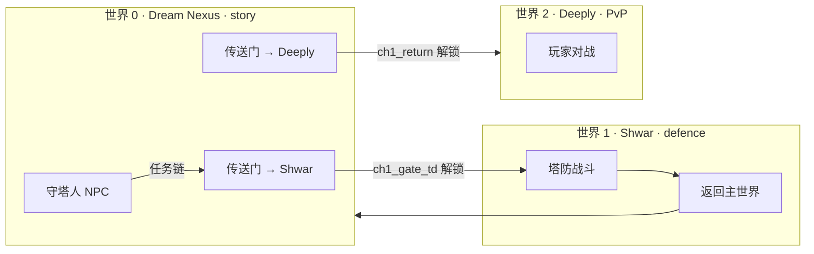
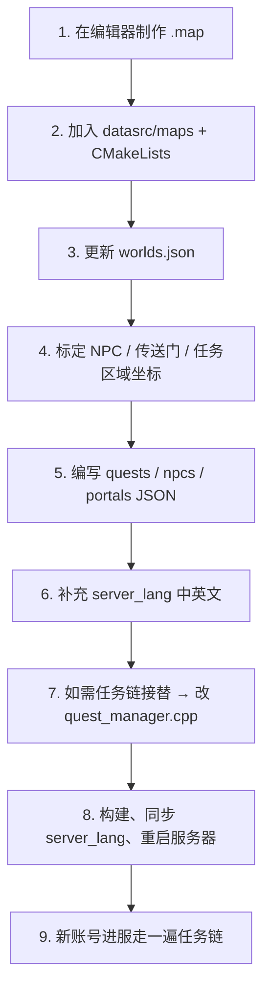

# 剧情与地图制作指南

本文档说明如何在 TeeDefenceArchive 中制作**剧情世界（Story）**、配置**多世界地图**、编写**任务链**与**传送门**，并完成本地化与部署。

---

## 1. 架构概览

服务器采用「多世界 + 门控旅行」结构：

| 概念 | 说明 |
|------|------|
| **世界（World）** | `worlds.json` 中的一项，有独立地图、游戏模式、玩家实例 |
| **世界 ID** | 数组下标，从 `0` 开始（0 = 第一个世界） |
| **剧情世界** | `mode: "story"`，无塔防波次，用于 NPC / 任务 / 传送枢纽 |
| **门控旅行** | `travel_locked: true` 的世界需完成任务或走传送门才能进入 |
| **传送门** | `portals.json` 中的区域检测，站立约 1 秒自动传送 |



**新玩家默认进入世界 0**（`sv_show_world_when_connect 0`）。

---

## 2. 相关文件一览

| 路径 | 用途 |
|------|------|
| `datasrc/maps/<名称>.map` | 地图源文件（编辑器制作） |
| `datasrc/maps/worlds.json` | 世界列表、模式、旅行锁定 |
| `server_content/quests.json` | 任务定义 |
| `server_content/npcs.json` | NPC 交互区域（逻辑坐标） |
| `server_content/portals.json` | 传送门区域与目标世界 |
| `server_lang/en.json` / `zh-cn.json` | 中英文文案 |
| `server_lang/index.json` | 语言列表 |
| `CMakeLists.txt` → `EXPECTED_DATA` | 声明需打包进 `data/maps/` 的地图 |
| `build-*/autoexec.cfg` | 服务器运行配置 |

构建后资源位置：

- 地图：`build-*/data/maps/`（经 `datasrc` 复制）
- 任务/NPC/传送：`build-*/server_content/`
- 语言：`build-*/data/server_lang/` **与** `build-*/server_lang/`（两处需同步，见第 8 节）

---

## 3. 制作地图

### 3.1 工具与基本流程

1. 使用 **Teeworlds 地图编辑器**（或项目兼容的 `.map` 编辑器）制作地图。
2. 将成品保存为 `datasrc/maps/你的地图名.map`（不要带 `.map` 后缀写进 `worlds.json`）。
3. 在 `CMakeLists.txt` 的 `EXPECTED_DATA` 中加入 `maps/你的地图名.map`。
4. 重新运行 CMake 并编译，确认 `build-*/data/maps/你的地图名.map` 存在。

### 3.2 世界模式对应的地图要求

| mode | 典型用途 | 地图建议 |
|------|----------|----------|
| `story` | 剧情枢纽 | 出生点、NPC 区、传送门标记区、少量装饰 |
| `defence` | 塔防 | 主塔实体、僵尸路径、资源点 |
| `pvp` | 对战 | 对称场地、出生点 |
| `hub` | 社交/挂机主城 | 开阔、少战斗逻辑 |

### 3.3 坐标系统

JSON 配置（任务区域、NPC、传送门）使用 **像素坐标**（与游戏内位置一致）：

```
像素 X = 瓦片列 × 32 + 16
像素 Y = 瓦片行 × 32 + 16
```

**标定坐标技巧：**

1. 进游戏站到目标位置，用服务器日志或调试命令记录坐标（亦可先在地图上数瓦片再换算）。
2. `radius` 为检测半径（像素），玩家角色中心进入圆形范围即触发。
3. 传送门默认需站立约 **1 秒**（`TickSpeed` 帧）才会触发旅行。

### 3.4 NPC 数据驱动 + 可见 Bot

剧情 NPC **不**从地图 Game 层实体读取，统一在 `server_content/npcs.json` 配置。  
服务器按配置生成**静止的可见 Tee（dummy bot）**，玩家用**锤子（F3）**在 64px 内与之交谈。  
地图只负责地形与装饰，NPC 位置以 JSON 为准。

### 3.5 注册新世界

编辑 `datasrc/maps/worlds.json`：

```json
{
    "worlds": [
        {
            "title": "Dream Nexus",
            "map": "TDef-Dream",
            "mode": "story",
            "travel_locked": false
        },
        {
            "title": "Shwar by Wartoz",
            "map": "TDef-Shwar",
            "mode": "defence",
            "travel_locked": true,
            "required_quest": "ch1_gate_td"
        }
    ]
}
```

| 字段 | 说明 |
|------|------|
| `title` | 世界显示名（投票菜单、聊天提示） |
| `map` | 地图文件名，不含 `.map` |
| `mode` | `story` / `defence` / `pvp` / `hub`（`social` 等同 `hub`） |
| `travel_locked` | `true` 时不能从投票菜单自由进入（需 `sv_free_world_travel 1` 才显示世界页） |
| `required_quest` | 旅行解锁所需任务 ID（完成该任务即可进入，见第 5.3 节） |

**世界 ID = 在 `worlds` 数组中的下标。** 调整顺序会改变所有 `world` 字段的编号，需同步修改 `portals.json`、`npcs.json` 与任务步骤中的 `world`。

---

## 4. 编写任务（quests.json）

路径：`server_content/quests.json`

### 4.1 任务结构

```json
{
    "id": "ch1_awakening",
    "title_key": "quest.ch1_awakening",
    "auto_grant": true,
    "steps": [
        { "type": "talk_npc", "npc": "dream_keeper" },
        { "type": "reach_zone", "world": 0, "x": 448, "y": 256, "radius": 64 }
    ],
    "rewards": { "items": [{ "id": 7, "num": 1 }] },
    "unlocks": ["ch1_gate_td"]
}
```

| 字段 | 说明 |
|------|------|
| `id` | 任务唯一 ID，用于解锁、存档、代码引用 |
| `title_key` | `server_lang` 中的标题键，缺省则为 `quest.<id>` |
| `auto_grant` | `true` 时玩家登录后自动接取 |
| `steps` | 有序步骤列表，全部完成后任务结束 |
| `rewards.items` | 奖励物品（仅读取第一项 `id` / `num`） |
| `unlocks` | 完成后写入旅行解锁标记（字符串数组） |
| `next_quest` | 完成后自动接取的下一任务 ID（可选，链式剧情用） |

### 4.2 步骤类型

| type | 字段 | 触发条件 |
|------|------|----------|
| `talk_npc` | `npc` | 锤子（F3）击中 NPC，或 `/talk <npc>` / `/talk` 找最近 NPC |
| `reach_zone` | `world`, `x`, `y`, `radius` | 玩家进入指定世界内的圆形区域 |
| `kill_enemy` | `count`（可选，默认 1） | 击杀僵尸类敌人（塔防世界） |
| `collect_item` | `item`, `count` | 背包中物品数量达到要求 |

步骤说明文案键：`quest.step.<type>`（如 `quest.step.talk_npc`），需在语言文件中定义。

### 4.3 旅行解锁

两种方式让玩家获得前往某世界的资格：

1. **任务 `unlocks` 数组** — 完成后写入解锁标记，如 `"ch1_gate_td"`。
2. **完成 `id` 与解锁名相同的任务** — `HasTravelUnlock` 也认可「已完成任务 ID == 解锁名」。

`worlds.json` 的 `required_quest` 与 `portals.json` 的 `require_quest` 均引用上述解锁名。

### 4.4 第一章任务链（当前实现）

无。因为唐。

### 4.5 玩家如何查看任务

- 投票菜单（ESC）→ **任务**
- 靠近守塔人用**锤子（F3）**交谈，或 `/talk dream_keeper`

任务进度保存在 MySQL 账号的 `QuestData` 字段（需 `sv_mysql_enable 1`）。

---

## 5. NPC（npcs.json）

```json
{
    "npcs": [
        {
            "id": "dream_keeper",
            "world": 0,
            "x": 384,
            "y": 256,
            "radius": 120,
            "name_key": "npc.dream_keeper.name",
            "skin": "standard",
            "decoration": "uniban",
            "emote": "happy",
            "static": true
        }
    ]
}
```

| 字段 | 说明 |
|------|------|
| `id` | 与任务步骤 `npc`、对话键 `npc.<id>.talk` 对应 |
| `world` | 所在世界 ID |
| `x`, `y` | NPC 站立位置（像素）；服务器在此生成可见 Tee |
| `radius` | `/talk` 与区域检测半径（像素） |
| `name_key` | 显示名本地化键，缺省为 `npc.<id>.name` |
| `skin` / `body` | Tee 身体皮肤部件名 |
| `decoration` | 装饰皮肤部件名 |
| `emote` | 表情：`happy`、`normal`、`blink` 等 |
| `static` | `true` 时 NPC 固定于坐标，不可推动 |

**交互方式：** 玩家装备锤子，靠近 NPC 64px 内按攻击键（F3）触发对话；`/talk` 仍可作为备用。

---

## 6. 传送门（portals.json）

```json
{
    "portals": [
        {
            "id": "to_shwar",
            "world": 0,
            "x": 512,
            "y": 256,
            "radius": 72,
            "dest_world": 1,
            "dest_x": 0,
            "dest_y": 0,
            "require_quest": "ch1_gate_td"
        }
    ]
}
```

| 字段 | 说明 |
|------|------|
| `id` | 传送门唯一名（调试用） |
| `world` | 传送门所在世界 |
| `x`, `y`, `radius` | 触发区域 |
| `dest_world` | 目标世界 ID |
| `dest_x`, `dest_y` | 落点像素坐标（可选，0,0 则用目标世界出生点） |
| `require_quest` | 需要旅行解锁标记（可选） |
| `require_item` | 需要背包物品 ID（可选） |

进入区域时聊天提示 `portal.enter`；静止约 1 秒后执行传送。

---

## 7. 本地化（server_lang）

每个文案键需在 **`en.json` 与 `zh-cn.json` 中同时添加**。

### 7.1 剧情相关键名约定

| 用途 | 键名示例 |
|------|----------|
| 任务标题 | `quest.ch1_awakening` |
| 任务描述 | `quest.ch1_awakening.desc` |
| NPC 对话 | `npc.dream_keeper.talk` |
| 步骤类型 | `quest.step.talk_npc` |
| 传送 / 旅行 | `portal.enter`, `travel.need_quest`, `travel.to` |
| 进入剧情世界 | `account.enter_game_story` |
| 投票菜单 | `menu.goto.quests`, `quest.menu.title` |

### 7.2 新增任务 checklist

- [ ] `quest.<id>` 标题
- [ ] `quest.<id>.desc` 描述
- [ ] 各步骤 `quest.step.<type>`（若自定义类型需加代码）
- [ ] 涉及 NPC 的 `npc.<id>.talk`
- [ ] 新物品奖励的 `item.id.<n>`（若尚未定义）

---

## 8. 构建与部署

```bash
cd build-mysql
cmake ..
cmake --build . --target ArchiveServer
```

### 8.1 服务器配置（autoexec.cfg 建议）

```
sv_map TDef-Dream
sv_show_world_when_connect 0
sv_free_world_travel 0
sv_mysql_enable 1
```

| 配置 | 建议值 | 说明 |
|------|--------|------|
| `sv_map` | 与世界 0 的 `map` 一致 | 避免启动时多余地图重载 |
| `sv_show_world_when_connect` | `0` | 新玩家进入剧情主世界 |
| `sv_free_world_travel` | `0` | 隐藏投票菜单「世界/地图」页，仅传送门与任务旅行 |

### 8.2 语言文件同步（重要）

存储路径优先读取 **`data/server_lang/`**。CMake 会同时复制到：

- `build-*/server_lang/`
- `build-*/data/server_lang/`

若只手动更新了其中一处，会出现「新文案不显示、仍显示键名或旧文本」。  
修改 `server_lang/*.json` 后请重新 CMake 配置，或手动同步到上述两个目录。

### 8.3 启动验证日志

```
[multiworld]: world 0: Dream Nexus mode=story (maps/TDef-Dream)
[quest]: loaded 5 quests
[quest]: loaded 1 npcs
[portal]: loaded 3 portals
[localization]: loaded 2 languages, 349 keys (default: zh-cn)
```

键数量应随语言文件增长；若仍为 `194 keys`，说明读到了旧的 `data/server_lang`。

---

## 9. 制作新章节推荐流程



1. **先搭地图骨架**：出生点、一条主路径、NPC 站台、传送门视觉标记。
2. **用占位坐标**写 JSON，进游戏实测后微调 `x/y/radius`。
3. **任务节奏**：每章 3–5 个短任务；`auto_grant` 仅用于章节入口任务。
4. **旅行门控**：先 `unlocks` 再配置 `portals` / `worlds.travel_locked`，避免玩家跳关。
5. **多世界测试**：完成解锁前后分别尝试投票切世界、走传送门、任务步骤推进。

---

## 10. 扩展与限制（开发者须知）

| 项目 | 现状 |
|------|------|
| 任务自动链接 | 在 `quests.json` 配置 `next_quest` 字段 |
| 剧情 NPC | `npcs.json` 生成可见 dummy bot；锤子 64px 内交谈，不在地图层摆实体 |
| 任务奖励 | 每条任务仅支持一种奖励物品（`rewards.items[0]`） |
| 击杀任务 | 仅在僵尸死亡时计数（塔防世界），无指定敌人类型字段 |
| 世界数量上限 | `ENGINE_MAX_WORLDS`（见 `protocol.h`） |

### 10.1 添加新剧情 NPC

1. 在 `npcs.json` 增加条目（`id`、`world`、`x`、`y`、`radius`，可选 `skin`、`emote`）。
2. 在 `server_lang` 增加 `npc.<id>.name` 与 `npc.<id>.talk`。
3. 在 `quests.json` 的步骤中引用新 `npc` ID。
4. 进游戏确认 NPC 出现在坐标处，用锤子（F3）测试对话。

---

## 11. 常用物品 ID（第一章）

| ID | 名称（zh-cn） | 用途示例 |
|----|---------------|----------|
| 7 | 僵尸之心 | `ch1_hearts` 收集目标 |
| 40 | 虚空碎片 | `ch1_return` 收集目标 |

更多物品见 `server_lang` 中 `item.id.*` 与 `server_content/td/items/` 定义。

---

## 12. 故障排查

| 现象 | 可能原因 | 处理 |
|------|----------|------|
| 文案显示为 `quest.ch1_xxx` 键名 | 语言文件未加载或键缺失 | 检查 `data/server_lang` 键数量；补全 en/zh-cn |
| 传送门无反应 | 坐标/半径不对或 `require_quest` 未解锁 | 进游戏实测坐标；先完成任务 |
| `/talk` 提示附近无人 | NPC 坐标与世界 ID 不匹配 | 核对 `npcs.json` 坐标与 `radius` |
| 锤子打 NPC 无反应 | 距离超过 64px 或有墙遮挡 | 靠近 NPC；确认 `static` NPC 已生成（日志 `loaded N npcs`） |
| 进服不是剧情世界 | `sv_show_world_when_connect` 不对 | 设为 `0` |
| 地图未更新 | 未加入 `EXPECTED_DATA` 或未重新 CMake | 检查 `build-*/data/maps/` |
| 客户端显示 Mine-Craft 但逻辑是剧情 | 占位图与主城地图相同 | 使用独立 `TDef-Dream.map`，勿与 `Mine-Craft` 字节完全相同 |

---

## 13. 参考：当前生产配置摘要

- **世界 0**：`TDef-Dream`，`story`，主世界枢纽  
- **世界 1**：`TDef-Shwar`，`defence`，需 `ch1_gate_td`  
- **世界 2**：`TDef-Deeply`，`pvp`，需 `ch1_return`  
- **世界 3–4**：`hub`，`travel_locked: true`  

详细数值以仓库内 `datasrc/maps/worlds.json`、`server_content/*.json` 为准。

---